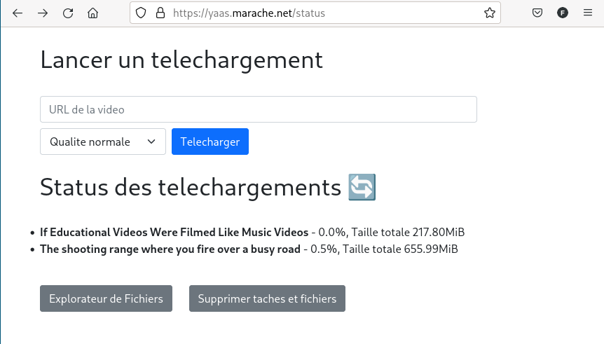

**Note:** *This repository has been archived as my cloud provider has been blacklisted by YouTube and I am no longer able to use this project. Besides, the latest versions of the YouTube downloader libraries have managed to get around the bandwidth throttling issue which was the primary reason I created this project.*

# Youtube-dl as a service

A very simple front-end for [youtube-dl](https://youtube-dl.org/). Used to download videos from [Youtube](https://www.youtube.com/) and other popular video services into the server and then provide a mean to browse and download the files.

It is a tiny Python3 [Flask](https://flask.palletsprojects.com/en/2.0.x/) server which offload the downloads to [Celery](https://docs.celeryproject.org/en/stable/index.html) workers ([Redis](https://redis.io/) is used as the backend/broker). The UI is a simple HTML page made with [Bootstrap](https://getbootstrap.com/).

Is is a week-end hack that I did for myself, so there is no multi-tenancy and I took a few shortcuts. Put it behind your favorite
HTTPS reverse proxy ([Caddy](https://caddyserver.com/) handle file browsing, TLS encryption, certificate management and Basic authentication for me).

The flask server expose 3 endpoints:
- `/clean` which will stop all pending celery tasks and start a job to remove all files in `$VIDEO_DIR`
- `/status` which is the main entrypoint for the browser and return a web page to trigger a file download job and monitor current downloads
- `/download` which is called by /status from the form to start a new download

The reverse proxy should expose `/files` as well to browse the downloaded files.



Sample Caddyfile:

```
yaas.marache.net {
  basicauth {
    bob {$YAAS_BASICAUTH}
  }
  rewrite /files /files/
  rewrite / /status

  file_server /files/* browse {
    root /srv/yaas/
  }

  reverse_proxy /clean http://yaas:5000
  reverse_proxy /status http://yaas:5000
  reverse_proxy /download http://yaas:5000
}
```
